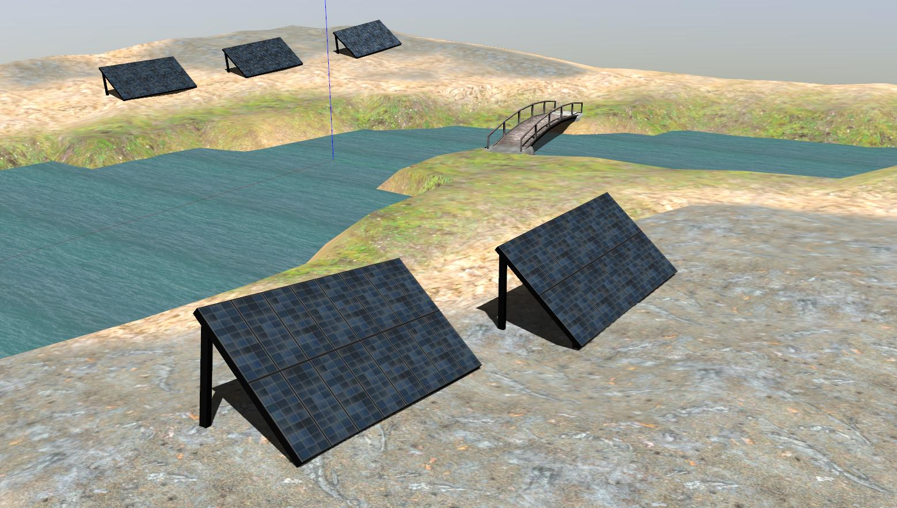
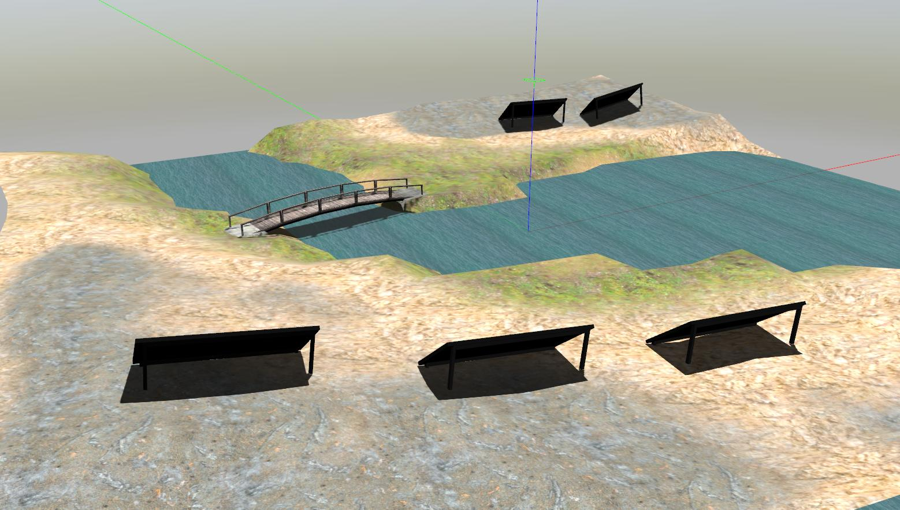
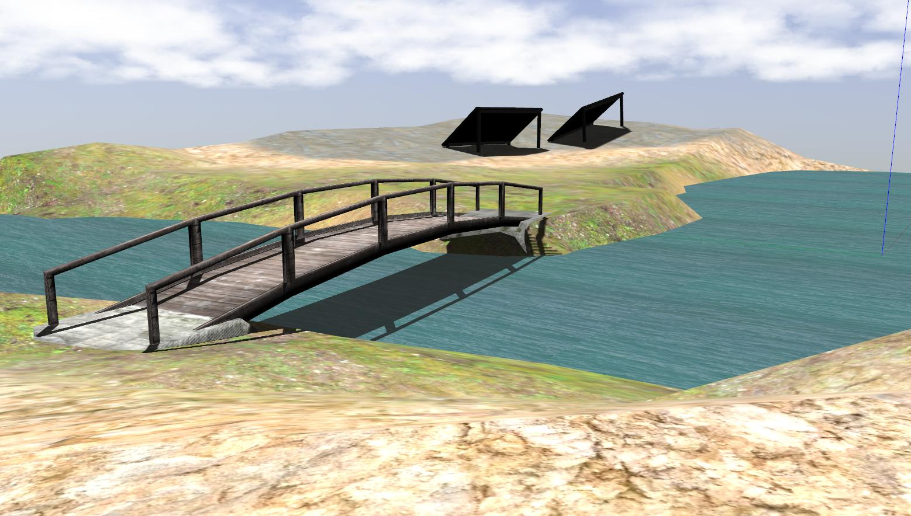
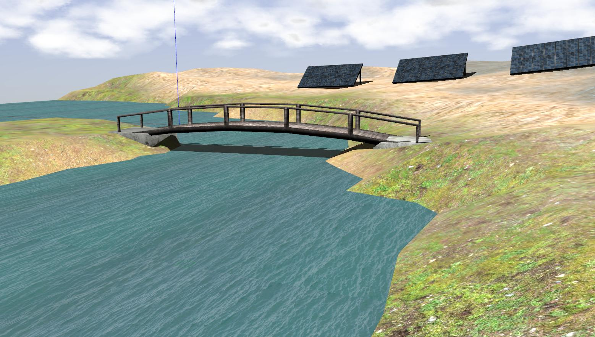

# cpr_inspection_gazebo

Modified clearpathrobotics outdoor simulation world for Gazebo.

Flattened solar panels ground such that is easier for smaller robots to access them.

Fixed water rendering issue.


## Supported Platrofms

### Husky


### Jackal


### Warthog


### Moose


### Heron


## Launching

```roslaunch cpr_inspection_gazebo inspection_world_only.launch```

Optionally, you can specify a platform using the platform variable:

```roslaunch cpr_inspection_gazebo inspection_world.launch platform:=jackal```

Supported values for the platform variable are:
* husky (default)
* jackal
* warthog
* moose
* heron

The spawn location for the robot can be specified by setting the `x`, `y`, `z`, and `yaw` variables.  Note that some X/Y positions
may place the robot over the water feature instead of on dry land.  The Z value should be set to be above ground-level; otherwise
the robot may fall through the ground plane as the environment renders.

NOTE: the Heron's spawn location cannot be customized; it will always spawn in the same position on the water.

## Features

This is a large, open outdoor world for Gazebo that has:

### Solar Panels




### Bridge



### Water physics


