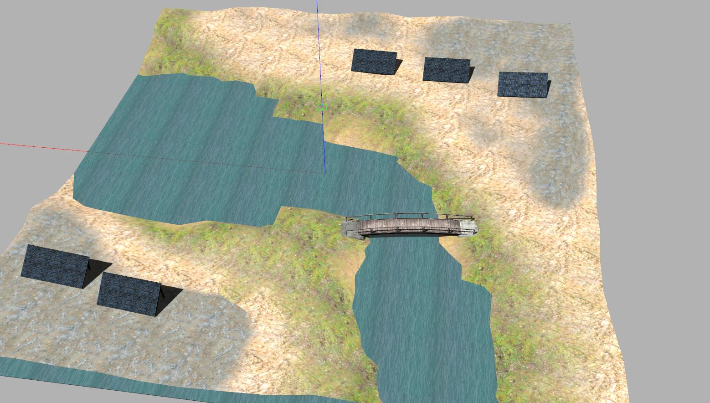
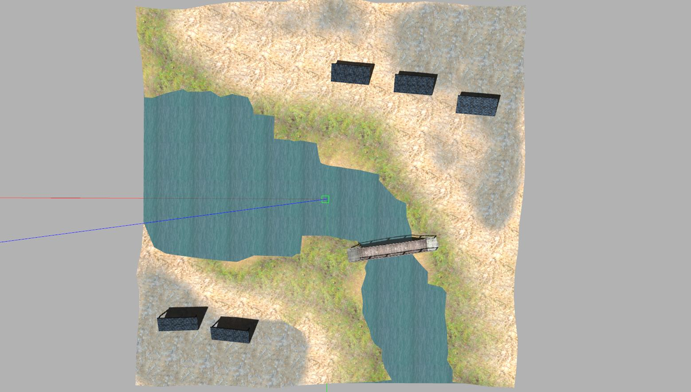

# Solar Farm Inspection 

Modified clearpathrobotics outdoor simulation world for Gazebo.

Flattened solar panels ground such that is easier for smaller robots to access them.

Fixed water rendering issue.




# Multi-Jackal and Multi-Warthog Simulator using Gazebo ROS Noetic
Here you find launch files to spawn and simulate multiple Jackals and Warthogs in Gazebo.
It uses the Clearpath's packages modified to accomodate multiple robots.

# Setup
To setup the solar farm simulation with multiple Jackals and Warthogs follow the instructions bellow to install the necessary dependencies:

```sh
roscd
```

```sh
git clone https://github.com/cazevedo/battery_mockup.git
```

```sh
git clone https://github.com/cazevedo/cpr_gazebo.git
```

```sh
git clone https://github.com/cazevedo/robot_state_publisher2.git
```

```sh
git clone https://github.com/amdpaula/multi_warthog.git
```

```sh
git clone https://github.com/amdpaula/multi_jackal.git
```

```sh
catkin build
```

# Run
Terminal #1
```sh
roslaunch multi_jackal_tutorials three_robot_inspection.launch
```
